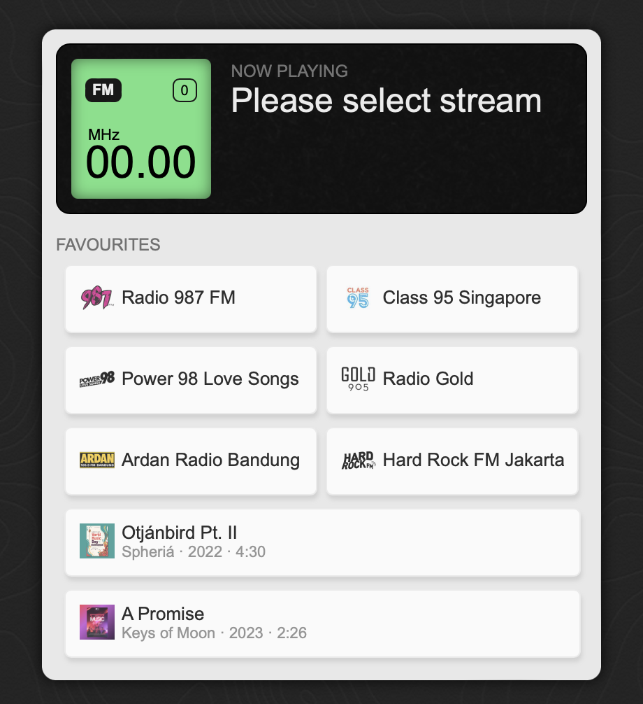

## Web Media Player
this a simple media player built because
first i needed to listen to a playlist to stream only my favourite radios.<br>
there are lots of free streaming audio sites, but my preference is different.<br>
there are lots of front end framework but this one is made using vanilla js ✨<br>
requires latest browsers that support ES modules<br>
tested on Safari<br>
<br>
I ❤️ DOM
<br>

### Specs
#### Playlist metadata
* id (type:int)
* title (type:string)
* stream_url (type:string)
* signal (type:string)
* image (type:object)..
    logo (for radio)
    album (for music)
    poster (for movie)
* background (type:string)
* meta (type:object)
#### Sample
```
[
    {
        "id": 1,
        "type": "radio",
        "title":"Radio radio",
        "signal": "00.0 FM",
        "stream_url": "stream url here",
        "image": {
            "logo": "/images/logo/gold-90-5-fm.png"
        },
        "background": "",
        "meta": {}
    },
    {
        "id": 2,
        "type": "radio",
        "title":"Radio radio",
        "signal": "01.0 FM",
        "stream_url": "stream url here",
        "image": {
            "logo": "/images/logo/power98.png"
        },
        "background": "",
        "meta": {}
    },
    {
        "id": 3,
        "type": "music",
        "title":"Otjánbird Pt. II",
        "stream_url": "stream url here",
        "image": {
            "poster": "",
            "cover": "http://img.freepik.com/free-vector/hand-drawn-world-music-day-poster-template_23-2149412112.jpg?size=626&ext=jpg&ga=GA1.1.329083900.1694428562&semt=ais"
        },
        "background": "",
        "meta": {
            "artist": "Spheriá",
            "year": "2022",
            "duration": "270"
        }
    },
    {
        "id": 4,
        "type": "music",
        "title":"A Promise",
        "stream_url": "stream url here",
        "image": {
            "poster": "",
            "cover": "http://img.freepik.com/free-vector/music-event-poster-with-photo_52683-42061.jpg"
        },
        "background": "",
        "meta": {
            "artist": "Keys of Moon",
            "year": "2023",
            "duration": "146"
        }
    }
]
```
<br>

### Features
#### V1
* Player with play and volume
* Playlist only contains radio stream source

#### V1.1
* Playlist can play music source (.mp3, .aac)
* User switch between radio & music
* Player has controls for music: prev, next, play/pause

#### V1.2
* Player can control to repeat music

#### V1.3
* Player can handle video source
* User can switch between radio/music/video

<br><br>
### Dev Requirements
* sass installed to compile scss file
* server to serve the static files e.g.
    * `php -S localhost:8000`

### sass
Development:<br>
`sass --watch src/sass:css/`
<br>
Production:<br>
`sass src/sass/style.scss css/style.css --style compressed`

<br><br>
### Screenshots
Empty Player state<br>

<br>
Loaded Player state<br>


#### Image Credits
Music Poster from Freepik -> https://www.freepik.com/free-photos-vectors/music-poster


#### Music Credits
a promise by Keys of Moon | https://soundcloud.com/keysofmoon
Music promoted by https://www.chosic.com/free-music/all/
Creative Commons CC BY 4.0
https://creativecommons.org/licenses/by/4.0/


Otjánbird Pt. II by Spheriá | https://soundcloud.com/spheriamusic
Music promoted by https://www.chosic.com/free-music/all/
Creative Commons CC BY-SA 3.0
https://creativecommons.org/licenses/by-sa/3.0/